# Navigamer
*By  [Ben Ash](https://github.com/composerben), [Zaviar Brown](https://github.com/ZaviarBrown), [Ryan Dalton](https://github.com/DaltonR121), and [Logan Frye](https://github.com/Loganfrye714)*

Hey, listen! It's dangerous to keep track of all your gaming alone, take this! - [Navigamer Live Site](https://aa-navigamer.herokuapp.com/)

Navigamer is designed to help gamers keep track of which games they've already played, which games they have yet to play, and read reviews from other passionate gamers to learn more before starting a new game. Supporting nearly every console ever made, navigating through your immense game-library can be made easy with a few simple clicks. Don't see your favorite game? No worries! We're constantly growing thanks to over a trillion users around the world, and after signing up you can add any game that we might be missing. 

## Index
* [API Documentation](https://github.com/composerben/navigamer/wiki/API-Documentation)
* [Database Schema](https://github.com/composerben/navigamer/wiki/Database-Schema)
* [Frontend Routes](https://github.com/composerben/navigamer/wiki/Frontend-Routes)
* [MVP Feature List](https://github.com/composerben/navigamer/wiki/MVP-Feature-List)
* [User Stories](https://github.com/composerben/navigamer/wiki/User-Stories)

## Technologies Used
* JavaScript
* PUG
* SQL
* Express

## Summary
Navigamer is a Goodreads clone, created with the goal of providing gamers with a place to keep track of games they've played, as well as browse for new games to play. 
When first loading Navigamer, the home screen is a list of the 10 most recently reviewed games, so that visitors of Navigamer can see which games the community is currently talking about.

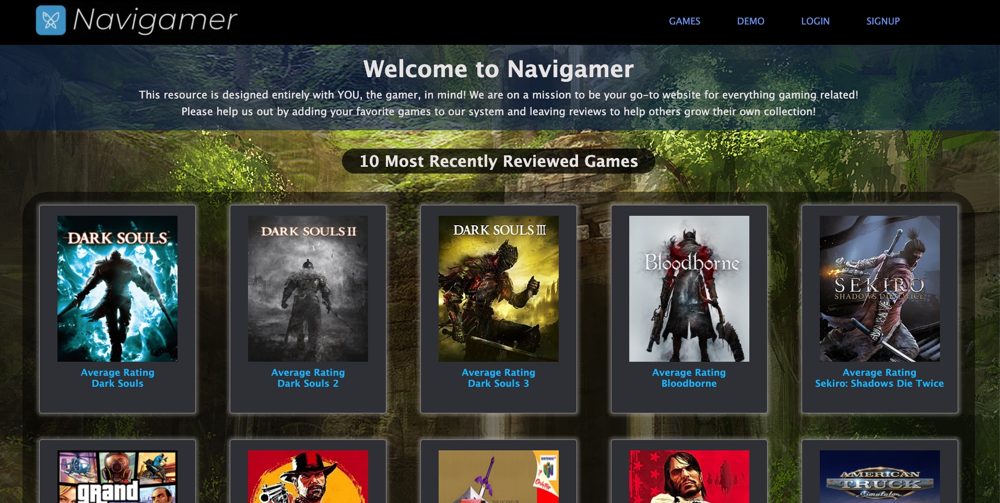

In the nav bar, there's a signup link for new users, a login link for returning users, and a demo link to browse the site as a guest. The demo option is also available on both the login and signup pages.
Upon logging in, a user is brought to their Gameshelf page. Here, a user can browse their own gameshelves, add a new gameshelf, click on any game currently added to their gameshelf, as well as click the "Add Game" button to add new games to any existing gameshelves.

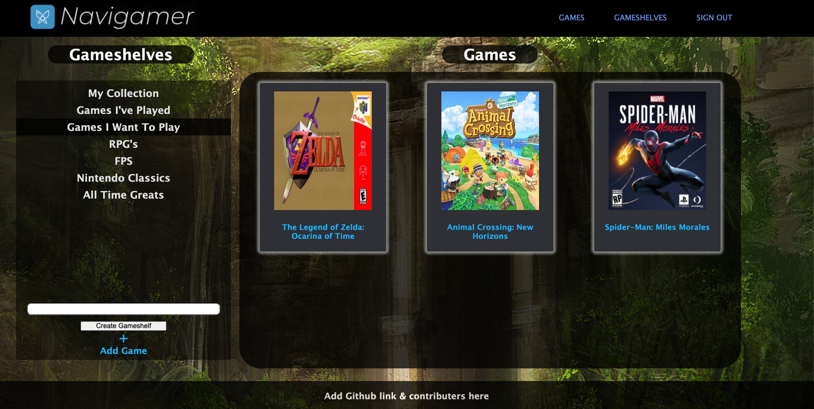

When the user clicks "Add Game", they are redirected to the main games page with ever title in our database. From there, they can check the games they wish to add and select the gameshelf they wish to add the games to.

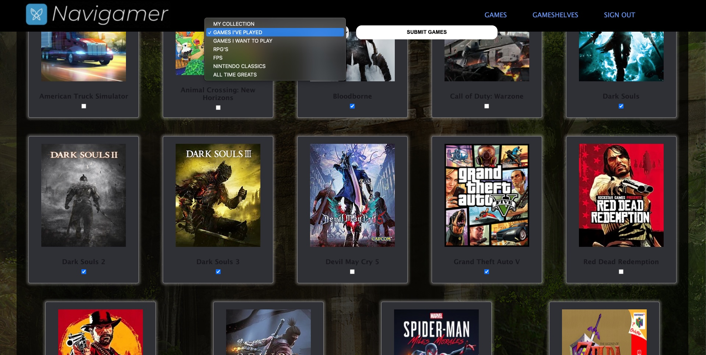

A user may also add games to our database by clicking the banner at the top of the "games" page. This takes them to a form to fill out the necessary information to add a game to our database.

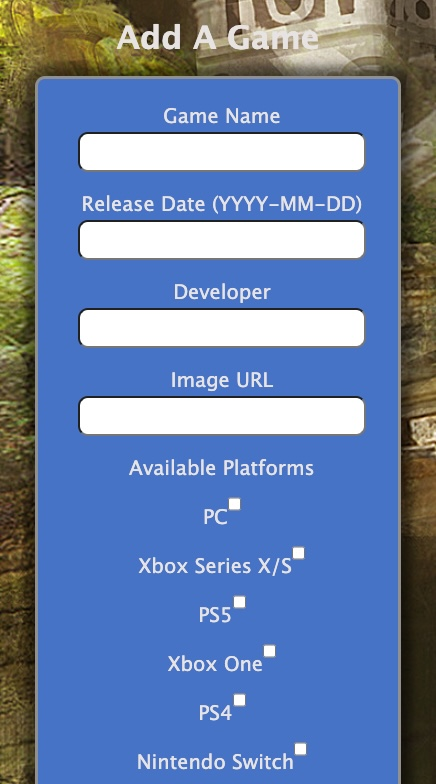

Each individual game has its own game page, displaying the games name, the developer of the game, the platforms the game is available on, and a short bio describing what the game is about.

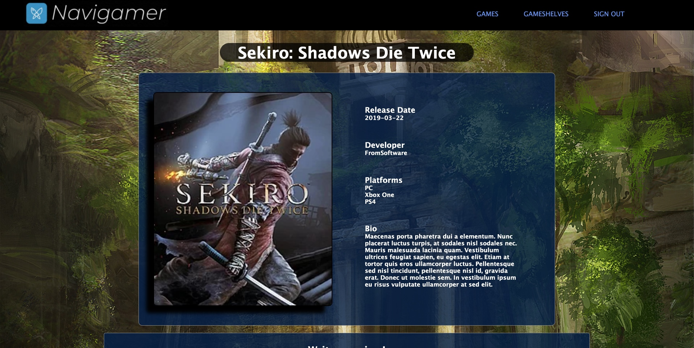

Underneath the information about the game is the review/rating section. This is a place where any logged in user can write a review and give a rating for their favorite games, as well as read the reviews from other passionate Navigamers!

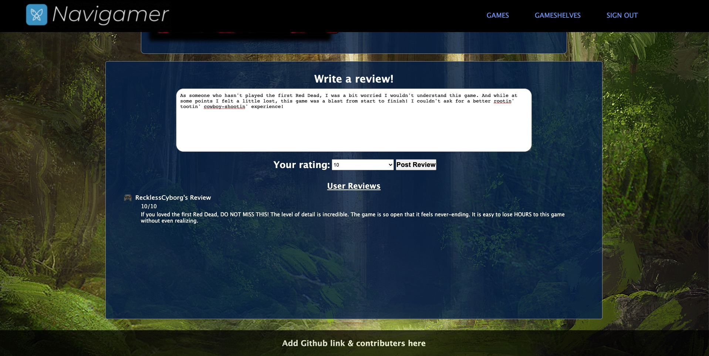

## Tough Boss Encounter
Building Navigamer wasn't an easy mission, we ran into a confusing hurdle along the way.

The issue we came across was providing our frontend with all the necessary information from our backend. In the beginning, we had completely forgotten that the frontend cannot directly query our database, so allowing reviews to be asynchronously added to the page posed quite a problem. Our workaround was to use the "data-" attribute in our PUG files. 

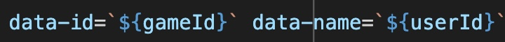

This allowed us to save values through string interpolation from our GET routes directly onto the PUG file. We used some fancy array work to map out all of the information we needed to pass over to the frontend. Once all our data was ready to go, we sent it to PUG alongside the render.

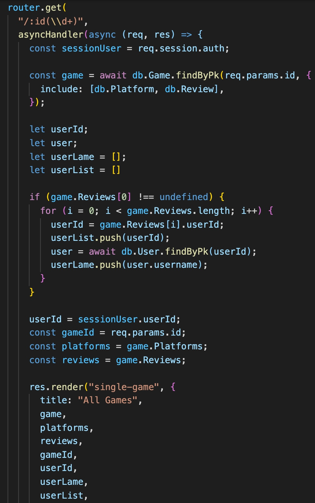

In PUG, we iterated through our arrays to store the userId's and gameId's we grabbed from our database into elements rendered on the page. 

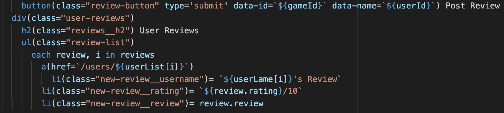

Then, in our file handling frontend DOM manipulation, we grabbed the data stored in those "data-" attributes

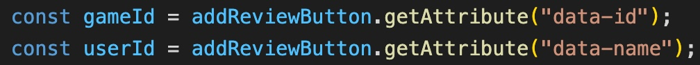

With the data successfully accessed, we were able to send the required values back to our post route and update the page asynchronously!

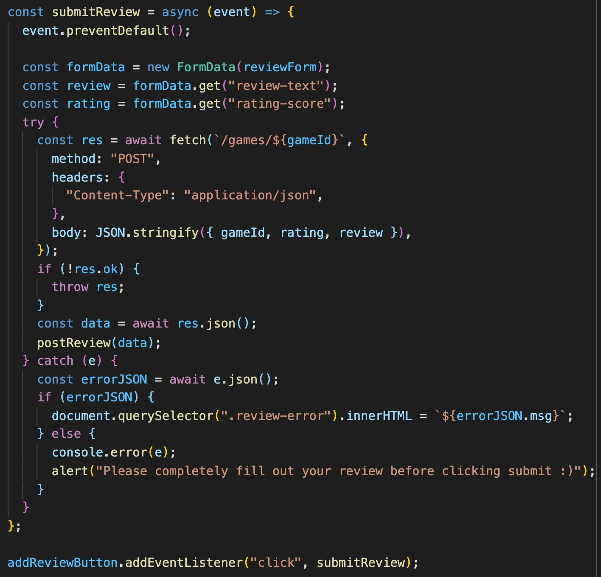

## Future Features
* Sorting games by top rated
* A randomizer button, taking the user to a random game page
* Likes and dislikes on reviews
* Search feature
* Check if a game being added actually exists.
